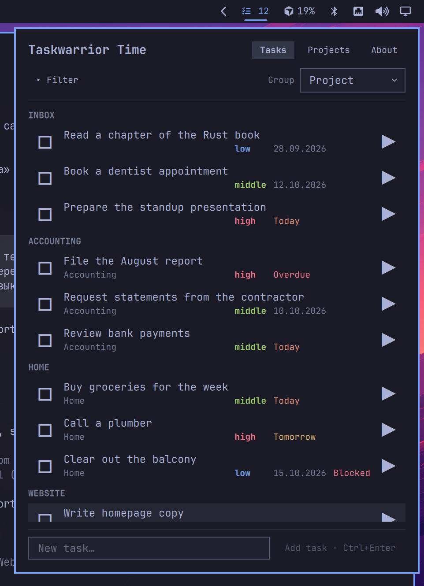
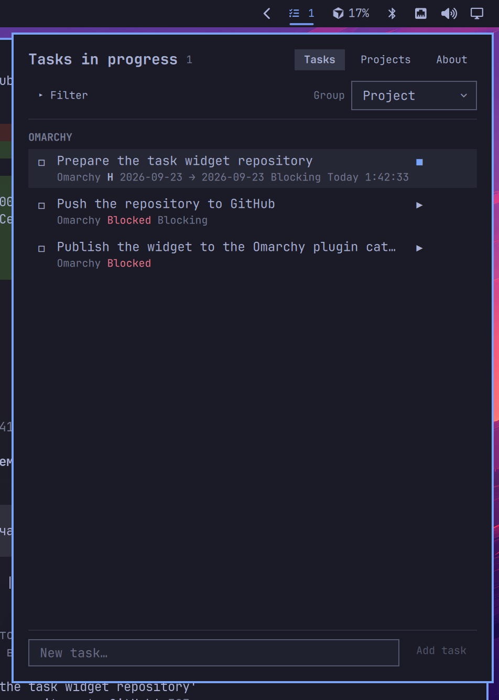
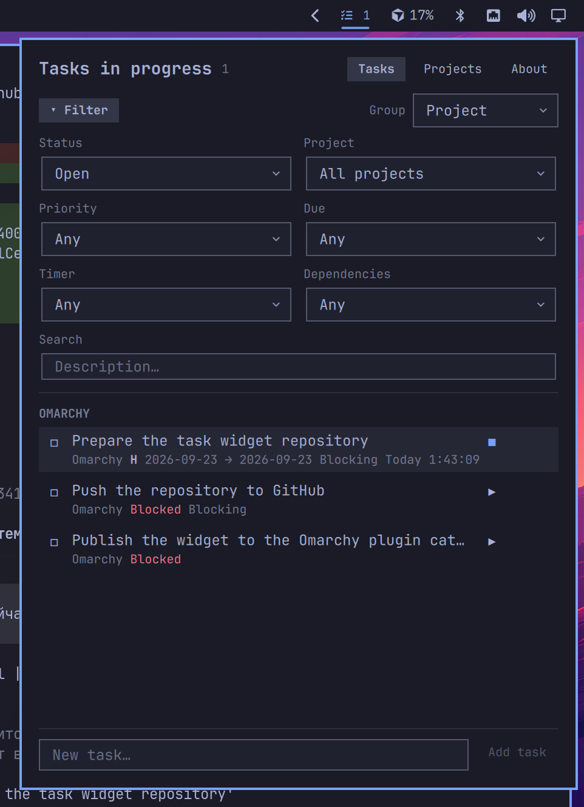
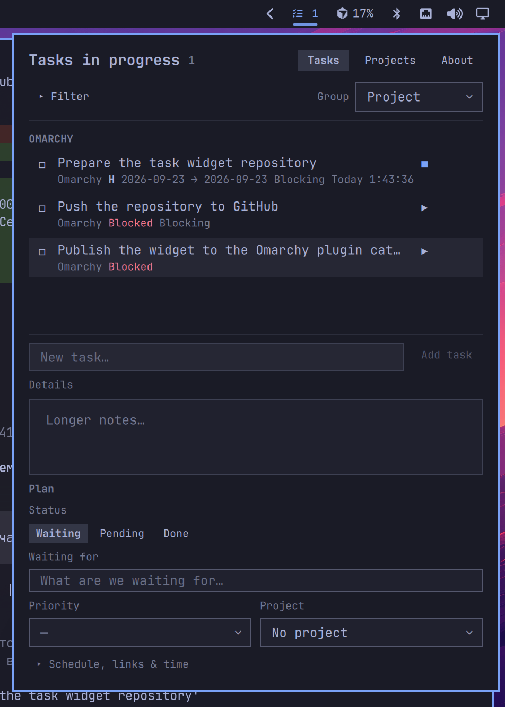
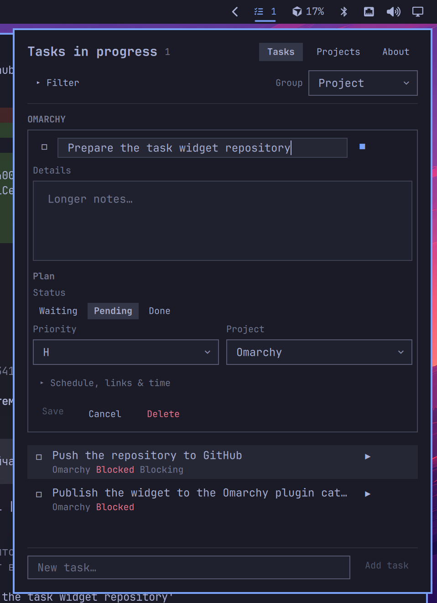
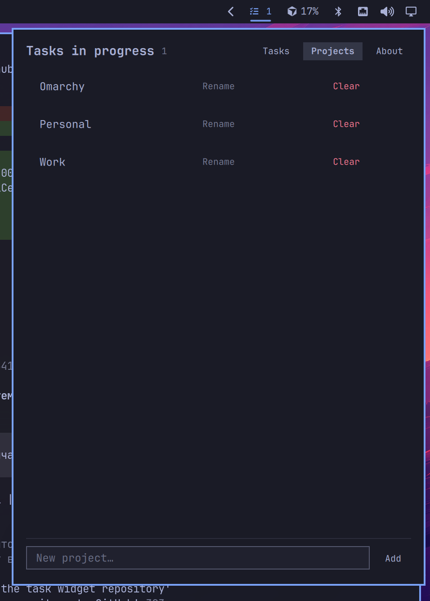
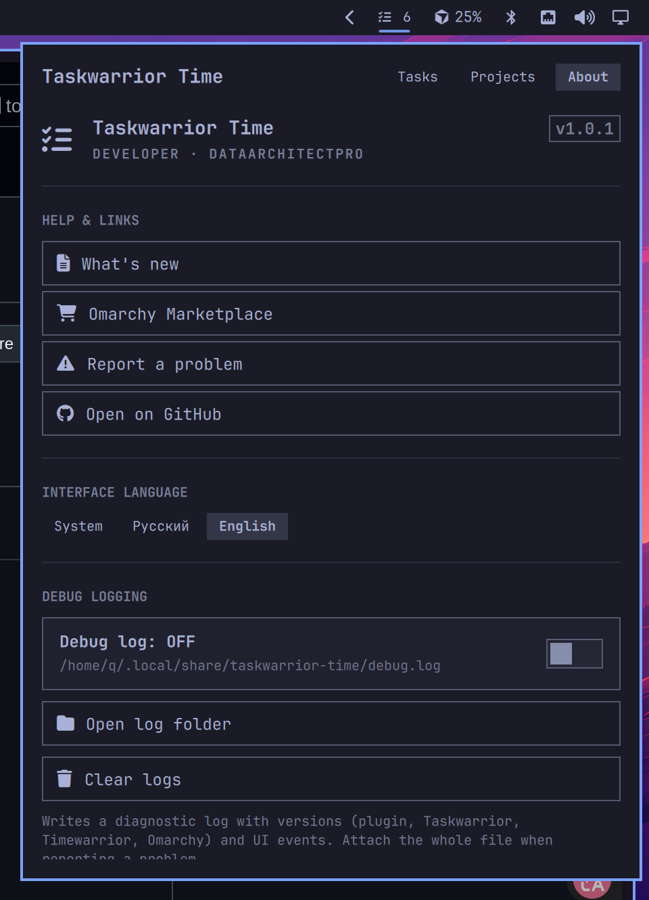

# Taskwarrior Time

**English** · [Русский](README.ru.md)

**Taskwarrior Time** is an [Omarchy](https://omarchy.org/) bar widget that brings **Taskwarrior** and **Timewarrior** into the shell panel. Create, edit, filter, and time-track tasks without leaving the desktop.



## What this is

**Taskwarrior Time** (plugin id `q.tasks`) is a **GUI companion** for the classic CLI task stack — not a separate task database.

| Component | Role |
| --- | --- |
| [Taskwarrior](https://taskwarrior.org/) (`task`) | Source of truth for tasks, projects, priorities, dates, dependencies, and status |
| [Timewarrior](https://timewarrior.net/) (`timew`) | Time tracking: start/stop timers and today totals (optional but recommended) |
| Omarchy shell | Host panel: this plugin talks to `task` / `timew` through a small local helper |

Anything you do here is stored in your normal Taskwarrior / Timewarrior data. You can still use the same tasks from the terminal (`task`, `timew`) — the panel is an add-on UI on top of those tools.

## Features

- **Task list** with grouping (project, priority, due, status) and a collapsible advanced filter
- **Create & edit** in place: title, details, status (Waiting / In progress / Done), waiting-for, outcome, priority, project
- **Schedule** fields (scheduled / due), **dependencies** (depends / blocks), and **Timewarrior** timers with manual time adjust
- **Projects** view: browse projects, rename, clear project from tasks
- **Unsaved changes** dialog when closing a dirty editor (Save / Keep editing / Discard)
- **i18n**: English and Russian UI (system language, or pick one in About)
- **About** tab with version, developer info, GitHub link, language switch, and debug logging toggle

### Task list



### Filter & search

Expand **Filter** to narrow by status, project, priority, due, timer, and dependencies, plus a free-text search over descriptions.



### New task composer

The sticky composer at the bottom expands into the same field layout as the editor: details, status, waiting-for, priority, project, and optional schedule / deps / time.



### Task editor

Click a task to edit it in place. Save when dirty, Cancel to collapse, or Delete.



### Projects

Switch to **Projects** to list projects, rename them, clear a project from all tasks, or add a new one.



## Requirements

- [Omarchy](https://omarchy.org/) Linux (Quickshell bar / plugin system)
- [Taskwarrior](https://taskwarrior.org/) (`task`) — install the `task` package from your distro
- [Timewarrior](https://timewarrior.net/) (`timew`) — optional but recommended for timers; install the `timew` package from your distro

The plugin does not install system packages itself. On Arch Linux the package names are `task` and `timew`.

## Install (Linux / Omarchy)

Preferred — Omarchy clones and enables the plugin for you:

```bash
omarchy plugin add https://github.com/DataArchitectPro/taskwarrior-time.git --enable --yes
```

Then place the widget on the bar if it is not already there (the installer may ask for a section), or add it manually:

```bash
omarchy bar move q.tasks --section right
```

Reload the shell if the icon does not appear:

```bash
omarchy restart shell
```

### Developer checkout

For local development, place or clone this repository at `~/.config/omarchy/plugins/q.tasks`, then:

```bash
omarchy plugin enable q.tasks --section right
omarchy restart shell
```

The plugin id is `q.tasks` (folder name under `~/.config/omarchy/plugins/`). The marketplace display name is **Taskwarrior Time**.

## Update

If the plugin was installed with `omarchy plugin add` (git remote present):

```bash
omarchy plugin update q.tasks --yes
```

Or manually:

```bash
git -C ~/.config/omarchy/plugins/q.tasks pull --ff-only
omarchy restart shell
```

Saved files under `~/.config/omarchy/plugins/` are hot-reloaded by the shell; a full restart is only needed if something fails to apply.

## Uninstall

```bash
omarchy plugin remove q.tasks
```

This disables the widget and deletes the git checkout under `~/.config/omarchy/plugins/q.tasks`. Your Taskwarrior / Timewarrior data is not removed.

## Usage

1. Left-click the Taskwarrior Time icon on the bar to open the panel.
2. Use **Tasks** / **Projects** in the header to switch views.
3. Expand **Filter** when you need status / project / priority / due / timer / deps or search.
4. Click a task to expand the editor; **Save**, **Cancel**, or **Delete** at the bottom of the card.
5. Focus the composer at the bottom to add a new task with the full form.
6. Open **About** in the header tabs for version info, GitHub, and debug logging.



## Debug logging

When something misbehaves, turn on debug logging from the **About** tab.

- Toggle **Debug log: ON / OFF** on the About tab.
- While enabled, the bar icon stays highlighted and the tooltip shows that logging is active.
- Events are appended to:

  `~/.local/share/q.tasks/debug.log`

The log is local only (it is not uploaded). Include relevant excerpts when you open a GitHub issue — they help reproduce UI and helper (`bin/q-tasks`) problems.

To turn logging off, open the **About** tab again and toggle it back to OFF (or delete/ignore the log file; the toggle controls whether new events are written).

## Reporting issues

If you hit a bug, a crash, wrong Taskwarrior/Timewarrior behavior, or a missing feature:

1. Check [existing issues](https://github.com/DataArchitectPro/taskwarrior-time/issues).
2. Open a [new issue](https://github.com/DataArchitectPro/taskwarrior-time/issues/new) with:
   - Omarchy / Taskwarrior Time version (see About)
   - Steps to reproduce
   - Expected vs actual behavior
   - Optional: a redacted snippet from `~/.local/share/q.tasks/debug.log`

Please do **not** paste secrets, tokens, or private task content.

## License

[MIT](LICENSE) — free to use, copy, modify, merge, publish, distribute, sublicense, and sell. Keep the copyright notice.

## Author

**DataArchitectPro** — [GitHub repository](https://github.com/DataArchitectPro/taskwarrior-time)
