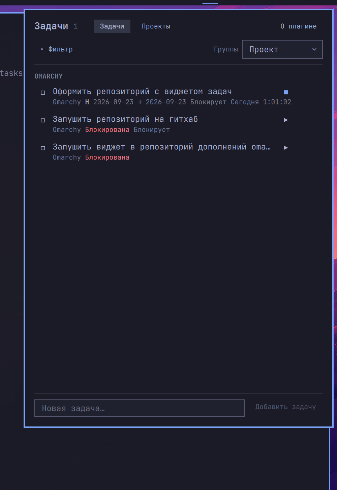
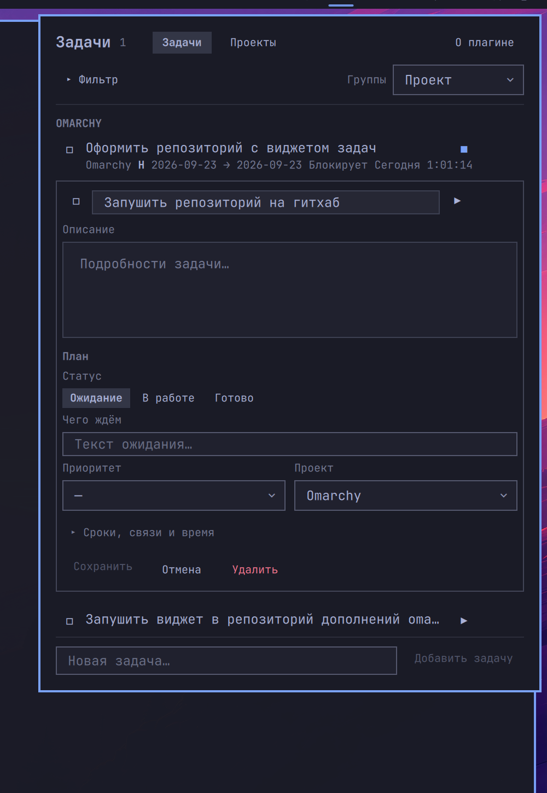
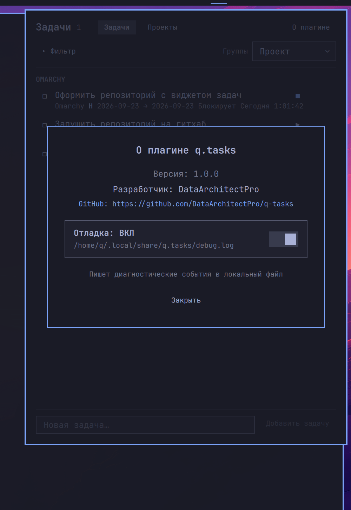

# q.tasks

Bar widget for [Omarchy](https://omarchy.org/) that brings **Taskwarrior** and **Timewarrior** into the shell panel. Create, edit, filter, and time-track tasks without leaving the desktop.



## Features

- **Task list** with grouping (project, priority, due, status) and a collapsible advanced filter
- **Create & edit** in place: title, details, status (Waiting / In progress / Done), waiting-for, outcome, priority, project
- **Schedule** fields (scheduled / due), **dependencies** (depends / blocks), and **Timewarrior** timers with manual time adjust
- **Projects** view: browse projects, rename, clear project from tasks
- **Unsaved changes** dialog when closing a dirty editor (Save / Keep editing / Discard)
- **i18n**: English and Russian UI (follows system locale)
- **About** dialog with version, developer info, GitHub link, and debug logging toggle



## Requirements

- [Omarchy](https://omarchy.org/) Linux (Quickshell bar / plugin system)
- [Taskwarrior](https://taskwarrior.org/) (`task`)
- [Timewarrior](https://timewarrior.net/) (`timew`) — recommended for timers; the panel still works without it for task CRUD

On Arch-based systems:

```bash
sudo pacman -S task timew
```

## Install (Linux / Omarchy)

From the Omarchy plugin CLI (preferred):

```bash
omarchy plugin add https://github.com/DataArchitectPro/q-tasks.git --enable --yes
```

Then place the widget on the bar if it is not already there (the installer may ask for a section), or add it manually:

```bash
omarchy bar move q.tasks --section right
```

Reload the shell if the icon does not appear:

```bash
omarchy restart shell
```

### Manual install

```bash
git clone https://github.com/DataArchitectPro/q-tasks.git ~/.config/omarchy/plugins/q.tasks
omarchy plugin enable q.tasks --section right
omarchy restart shell
```

The plugin id is `q.tasks` (folder name under `~/.config/omarchy/plugins/`).

## Update

If the plugin was installed with `omarchy plugin add` (git remote present):

```bash
omarchy plugin update q.tasks --yes
```

Or manually:

```bash
git -C ~/.config/omarchy/plugins/q.tasks pull --ff-only
omarchy restart shell
```

Saved files under `~/.config/omarchy/plugins/` are hot-reloaded by the shell; a full restart is only needed if something fails to apply.

## Usage

1. Left-click the tasks icon on the bar to open the panel.
2. Use **Tasks** / **Projects** in the header to switch views.
3. Click a task to expand the editor; **Save**, **Cancel**, or **Delete** at the bottom of the card.
4. Use the composer at the bottom to add a new task.
5. Open **About** (`О плагине`) in the header for version info, GitHub, and debug logging.



## Debug logging

When something misbehaves, turn on debug logging from **About** in the panel header.

- Toggle **Debug log: ON / OFF** in the About dialog.
- While enabled, the bar icon stays highlighted and the tooltip shows that logging is active.
- Events are appended to:

  `~/.local/share/q.tasks/debug.log`

The log is local only (it is not uploaded). Include relevant excerpts when you open a GitHub issue — they help reproduce UI and helper (`bin/q-tasks`) problems.

To turn logging off, open About again and toggle it back to OFF (or delete/ignore the log file; the toggle controls whether new events are written).

## Reporting issues

If you hit a bug, a crash, wrong Taskwarrior/Timewarrior behavior, or a missing feature:

1. Check [existing issues](https://github.com/DataArchitectPro/q-tasks/issues).
2. Open a [new issue](https://github.com/DataArchitectPro/q-tasks/issues/new) with:
   - Omarchy / plugin version (see About)
   - Steps to reproduce
   - Expected vs actual behavior
   - Optional: a redacted snippet from `~/.local/share/q.tasks/debug.log`

Please do **not** paste secrets, tokens, or private task content.

## License

No explicit license file yet — all rights reserved by the author unless stated otherwise. Contributions and issues are welcome via GitHub.

## Author

**DataArchitectPro** — [GitHub repository](https://github.com/DataArchitectPro/q-tasks)
