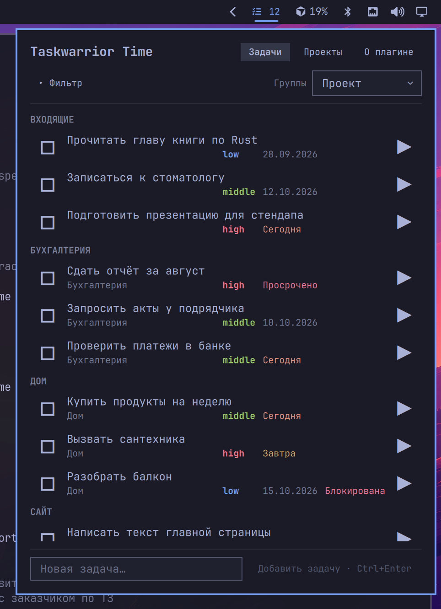
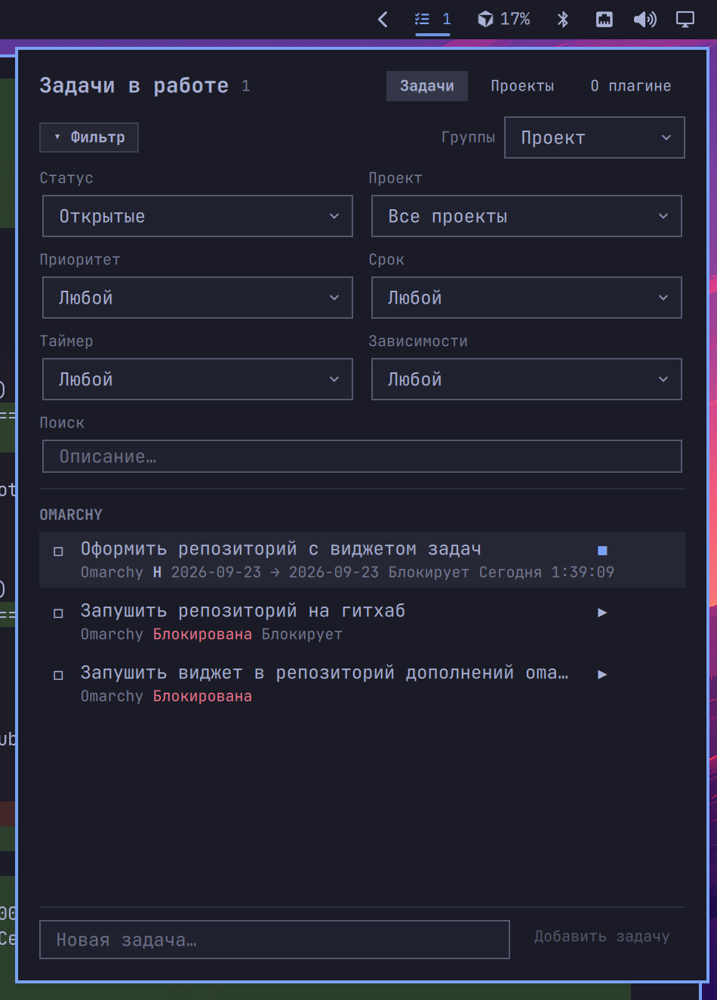
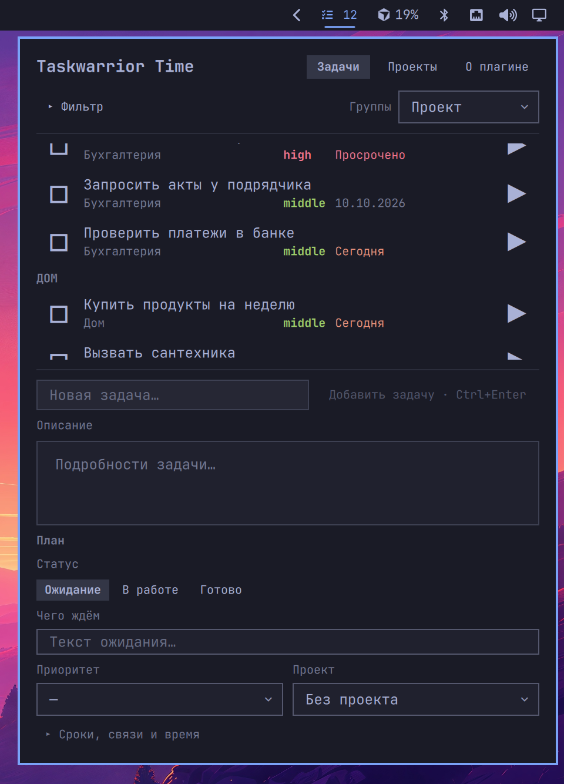
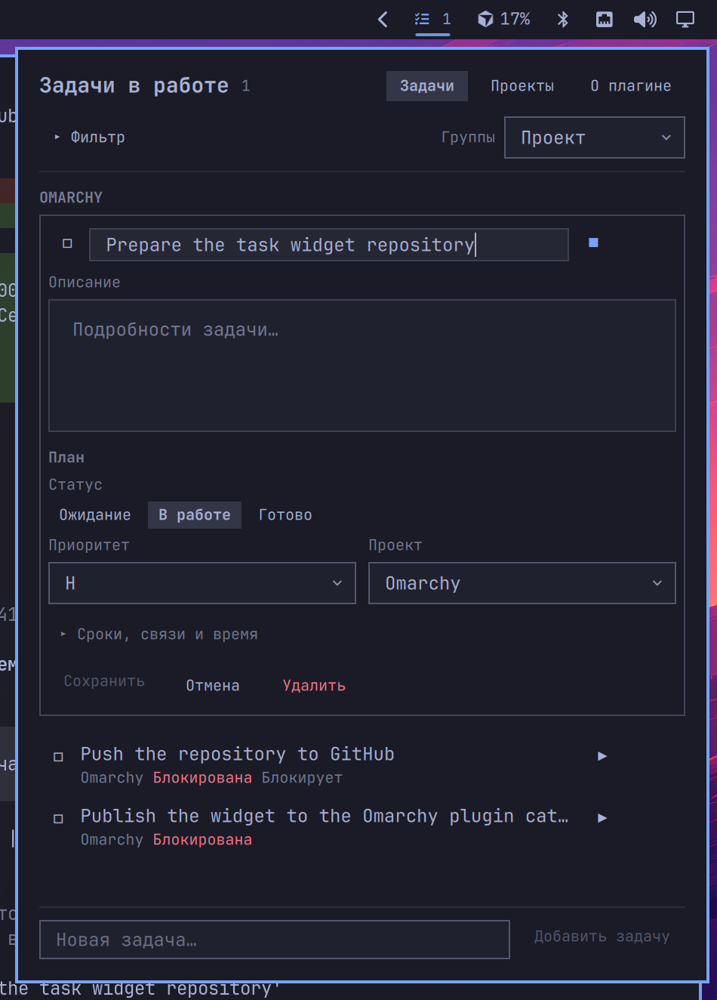
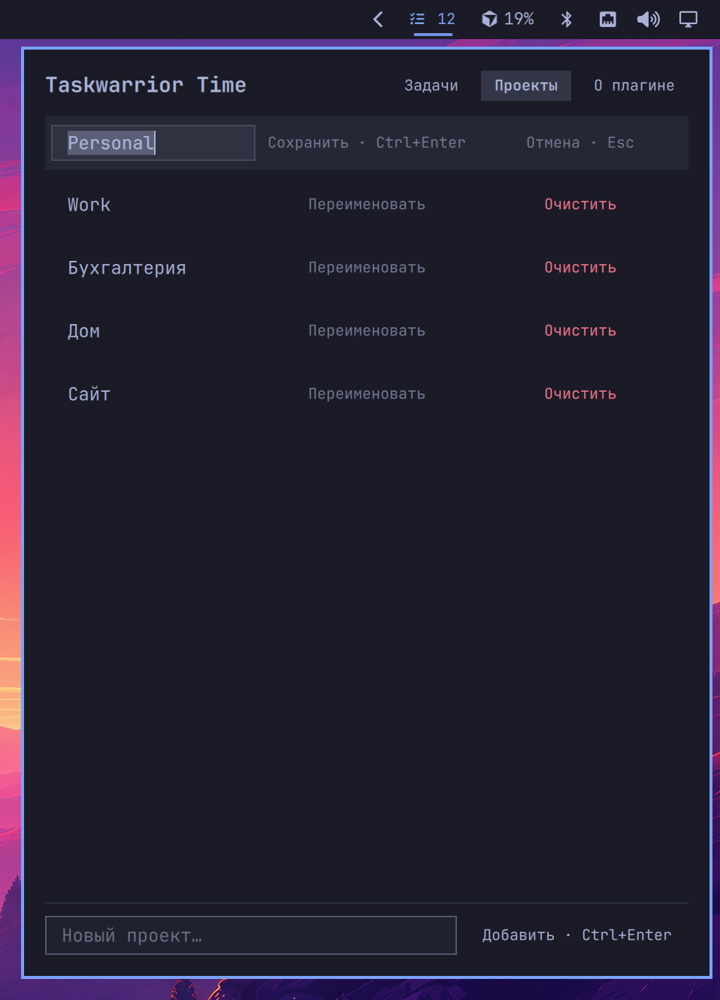
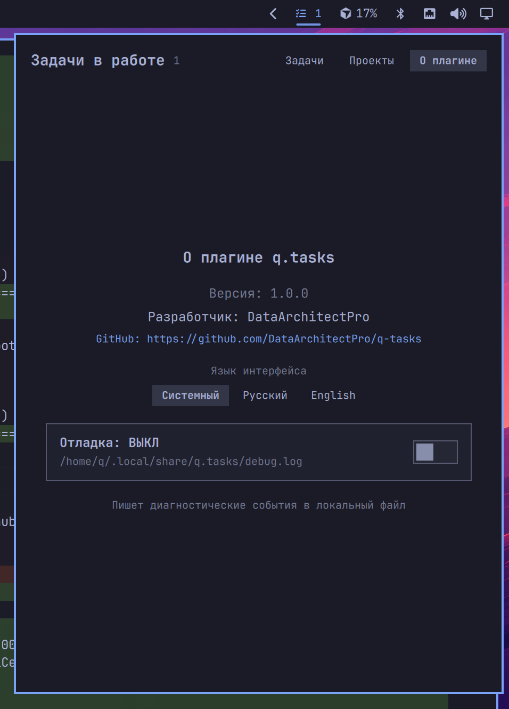

# q.tasks

[English](README.md) · **Русский**

Виджет панели [Omarchy](https://omarchy.org/), который выносит **Taskwarrior** и **Timewarrior** в shell. Создавайте, редактируйте, фильтруйте задачи и учитывайте время, не покидая рабочий стол.


## Что это такое

`q.tasks` — **графическая надстройка** над привычным консольным стеком задач, а не отдельная база.

| Компонент | Роль |
| --- | --- |
| [Taskwarrior](https://taskwarrior.org/) (`task`) | Источник правды: задачи, проекты, приоритеты, сроки, зависимости, статусы |
| [Timewarrior](https://timewarrior.net/) (`timew`) | Учёт времени: старт/стоп таймеров и итоги за день (желателен, но не обязателен) |
| Omarchy shell | Хост панели: плагин обращается к `task` / `timew` через локальный хелпер |

Всё, что вы делаете в панели, пишется в обычные данные Taskwarrior / Timewarrior. Те же задачи можно вести из терминала (`task`, `timew`) — панель лишь дополняет эти утилиты удобным UI.

## Возможности

- **Список задач** с группировкой (проект, приоритет, срок, статус) и сворачиваемым расширенным фильтром
- **Создание и редактирование** на месте: название, описание, статус (Ожидание / В работе / Готово), «чего ждём», итог, приоритет, проект
- Поля **сроков** (scheduled / due), **зависимости** (depends / blocks) и таймеры **Timewarrior** с ручной корректировкой времени
- Вкладка **Проекты**: просмотр, переименование, очистка проекта у задач
- Диалог **несохранённых изменений** при закрытии черновика (Сохранить / Продолжить / Отменить)
- **Локализация**: английский и русский (системный язык или выбор на вкладке «О плагине»)
- Вкладка **О плагине**: версия, разработчик, GitHub, язык интерфейса и отладочный лог

### Список задач



### Фильтр и поиск

Раскройте **Фильтр**, чтобы сузить список по статусу, проекту, приоритету, сроку, таймеру и зависимостям, плюс текстовый поиск по описанию.



### Форма новой задачи

Липкий композер внизу раскрывается в ту же раскладку полей, что и редактор: описание, статус, «чего ждём», приоритет, проект и опционально сроки / связи / время.



### Редактор задачи

Клик по задаче открывает редактирование на месте. **Сохранить** при изменениях, **Отмена** — свернуть, **Удалить** — удалить задачу.



### Проекты

Перейдите на вкладку **Проекты**, чтобы увидеть список, переименовать проект, очистить его у всех задач или добавить новый.



## Требования

- [Omarchy](https://omarchy.org/) Linux (Quickshell / система плагинов)
- [Taskwarrior](https://taskwarrior.org/) (`task`) — пакет `task` из репозитория дистрибутива
- [Timewarrior](https://timewarrior.net/) (`timew`) — желателен для таймеров; пакет `timew` из репозитория дистрибутива

Плагин сам системные пакеты не ставит. В Arch Linux пакеты называются `task` и `timew`.

## Установка (Linux / Omarchy)

Предпочтительно — Omarchy сам клонирует и включает плагин:

```bash
omarchy plugin add https://github.com/DataArchitectPro/q-tasks.git --enable --yes
```

Затем поместите виджет на панель, если его ещё нет (установщик может спросить секцию), или вручную:

```bash
omarchy bar move q.tasks --section right
```

Перезапустите shell, если иконка не появилась:

```bash
omarchy restart shell
```

### Checkout для разработки

Для локальной разработки положите или клонируйте этот репозиторий в `~/.config/omarchy/plugins/q.tasks`, затем:

```bash
omarchy plugin enable q.tasks --section right
omarchy restart shell
```

Идентификатор плагина — `q.tasks` (имя папки в `~/.config/omarchy/plugins/`).

## Обновление

Если плагин ставили через `omarchy plugin add` (есть git remote):

```bash
omarchy plugin update q.tasks --yes
```

Или вручную:

```bash
git -C ~/.config/omarchy/plugins/q.tasks pull --ff-only
omarchy restart shell
```

Файлы в `~/.config/omarchy/plugins/` подхватываются shell при сохранении; полный перезапуск нужен только если изменения не применились.

## Удаление

```bash
omarchy plugin remove q.tasks
```

Виджет отключается, каталог `~/.config/omarchy/plugins/q.tasks` удаляется. Данные Taskwarrior / Timewarrior не трогаются.

## Использование

1. ЛКМ по иконке задач на панели — открыть окно.
2. В шапке переключайте **Задачи** / **Проекты**.
3. Раскройте **Фильтр**, если нужны статус / проект / приоритет / срок / таймер / зависимости или поиск.
4. Клик по задаче раскрывает редактор; внизу карточки — **Сохранить**, **Отмена**, **Удалить**.
5. Фокус в композере внизу — создание новой задачи с полной формой.
6. Вкладка **О плагине** в шапке — версия, GitHub и отладочный лог.



## Отладочный лог

Если что-то ведёт себя странно, включите отладку на вкладке **О плагине**.

- Переключатель **Отладка: ВКЛ / ВЫКЛ**.
- Пока лог включён, иконка на панели подсвечивается, в подсказке видно, что логирование активно.
- События пишутся в:

  `~/.local/share/q.tasks/debug.log`

Лог только локальный (никуда не отправляется). При создании issue на GitHub полезно приложить релевантные фрагменты — так проще воспроизвести проблемы UI и хелпера (`bin/q-tasks`).

Чтобы выключить лог, снова откройте вкладку **О плагине** и переведите переключатель в ВЫКЛ.

## Сообщения об ошибках

Если нашли баг, падение, неверное поведение Taskwarrior/Timewarrior или хотите предложить функцию:

1. Посмотрите [существующие issues](https://github.com/DataArchitectPro/q-tasks/issues).
2. Создайте [новый issue](https://github.com/DataArchitectPro/q-tasks/issues/new) и укажите:
   - версию Omarchy / плагина (см. О плагине)
   - шаги воспроизведения
   - ожидаемое и фактическое поведение
   - по желанию: обезличенный фрагмент из `~/.local/share/q.tasks/debug.log`

Пожалуйста, **не** прикладывайте секреты, токены и приватное содержимое задач.

## Лицензия

[MIT](LICENSE) — можно свободно использовать, копировать, изменять, объединять, публиковать, распространять, сублицензировать и продавать. Нужно сохранять уведомление об авторских правах.

## Автор

**DataArchitectPro** — [репозиторий на GitHub](https://github.com/DataArchitectPro/q-tasks)
